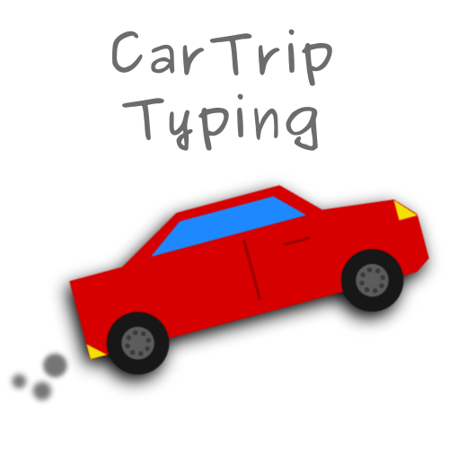

# Car Trip Typing Test

Test your typing with this test created through ducktape, dreams, and a collection of cartrips (almost exclusivley made in the car!)

* Three typing tests: "Random" words, buffalo, quickBrownFox
* Test WPM, accuracy, adjusted words-per-minute
* Written in under 200 lines of code (as of this writing)

## The duck-tape part

This test is flimsy! ~~Stability comes later when your goal is to make something in the car!~~

* Activating the test requires clicking on a space inside the testing area (see console.log if you're in the right spot)
* clicking off the horizontal space outside the border of the test pauses it to see the current results. clicking back on the test area and typing unpauses it
* However that feature only works once because I ran out of time to code more of a fix!
* getting to the end of the test and trying to type more gives you a barrage exciting red stuff in the console!
* will make more next car trip I promise

# ...Why?

If you're stuck in the car for the duration of around 2 hours for each trip, what are some of the things to do at your disposal?

Well... spontaneously write a typing test of course!

...no? Well dang just me then ok.

Anyway, this is an on-purpose constrained project to see what can be done with limited time, and resources. Due to being offline, there are no fancy frameworks either!

Nope, just pure vanilla JS and a browser; that's pretty much it. The project was written on a dirt-cheap laptop, and later a steam deck. It's overall a challenge to see what can be done with just the mind, and like... not to be bored.

I've done projects like this in the past, it's brought some random and fun things that I think about to this day. Coding in weird places and with odball things is quite entertaining really, an iPhone 4 on the beach, petit computer for DSi Ware, an iPad 2 shelling into a battery-powered raspberry pi in a hotel room (using a miniature router),and on this project, a steam deck with a keyboard ripped out of an ipad case.

WHAT DOES THIS ALL EQUATE TO?! Um... I'm weird I guess. But *also*, coding is *fun*, especially in weird scenarios and setups. Don't limit yourself to just your laptop, hack your way into writing something cool!
